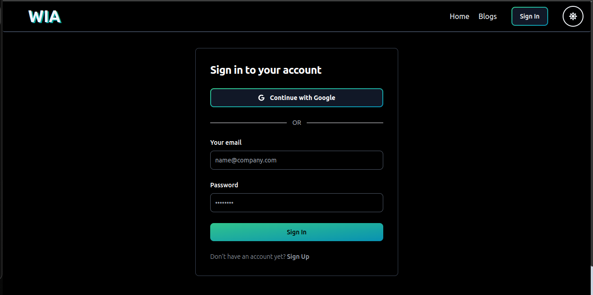
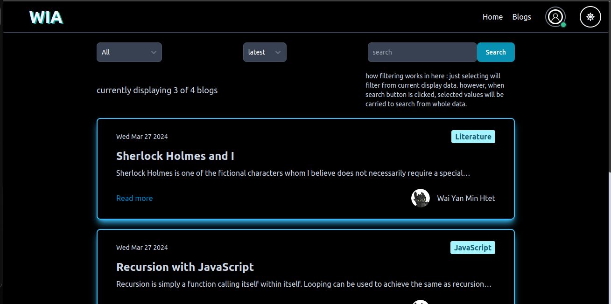
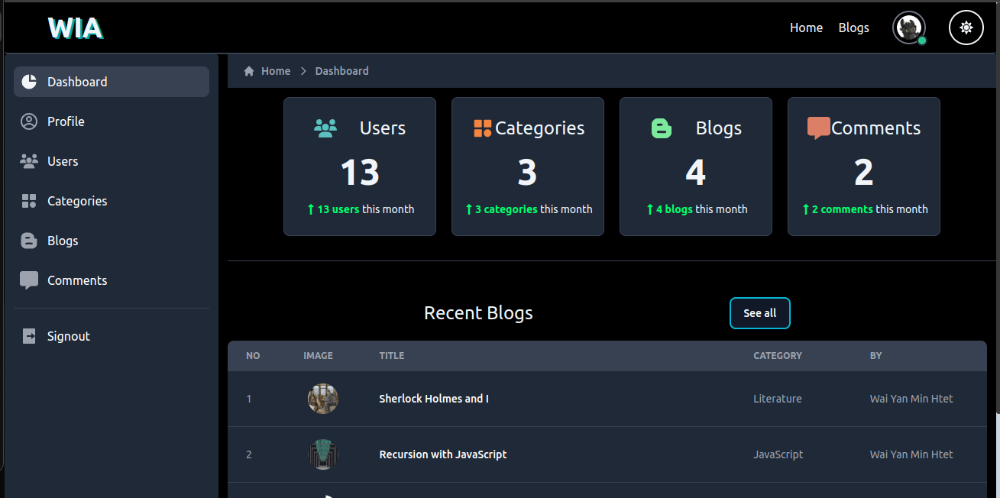

# Wia Blog

A typical blog site with MERN stack, nothing fancy going on here. 

## Features
- tradtional signup/signin/signout with jwt
- google login (firebase) with jwt 
- user profile info managements / update profile pic (firebase) 
- users, blogs, categories, and comments crud operations for admin
- comment && like && reply to a post

## Screenshots

## Demo
[Wia Blog demo](https://wia-blog.netlify.app/)

## Tech Stack
- HTML
- CSS
- Tailwind css with [flowbite-react](https://www.flowbite-react.com/)
- React
- Redux toolkit
- Firebase authentication && storage
- Expressjs
- MongoDB (Mongoose, Atlas)

## Hosting
-I'm utilizing [Glitch](https://glitch.com/) for backend and [Netilfy](https://www.netlify.com/)  for frontend.